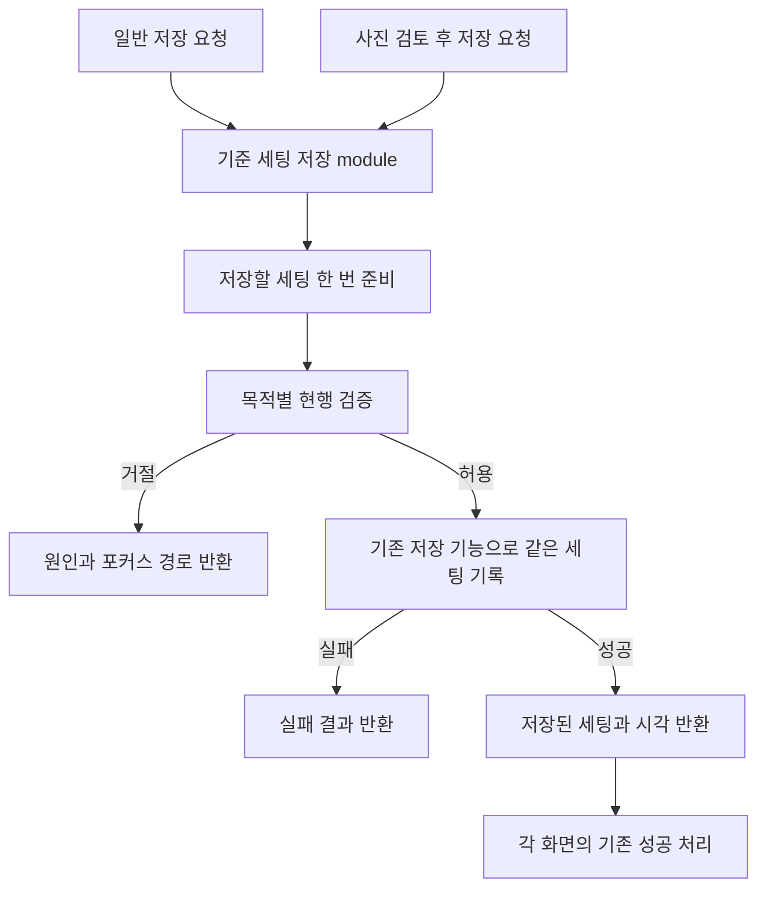

# 플래닛 트러블슈팅 — 코드 구조 개선 기록

작성일: 2026-10-01 KST

현행 상태: **TS-ARCH-001~004 구현 완료 / 관련 53개 회귀 통과 / 전체 613개 중 603개 통과·기준과 동일한 10개 실패 / 비운영 worktree**. 최신 실행 결과는 §7을 따른다.

이 문서는 코드에서 확인한 문제, 개선 판단, 보존할 동작, 구현·검증 결과를 누적하는 기술 기록이다. 사용자 결정의 원장은 [DECISIONS.md](DECISIONS.md)이며 여기에는 기술 근거와 작업 상태를 남긴다. 검토·제안·구현·실행 검증·게임 실측·운영 반영을 구분한다.

초기 진단 이력(§1~6)은 앱 소스 `d68d3806235c0f6960d2ed454481a729ae0327da`를 기준으로 작성했고 당시 앱 구현·실행 검증은 하지 않았다. 아래의 ‘현재’, ‘구현 전’, ‘미실행’은 그 초기 작성 시점의 기록으로 보존한다. 후속 구현은 `4a084bb1e9d2582f58548c9c72dad3a8a32e5f7b`에서 시작했으며 §7에 실제 구현·실행 검증을 추가했다.

기존 OCR 설명창 완전성 사례는 [OCR_TROUBLESHOOTING_.D](OCR_TROUBLESHOOTING_.D)에 보존한다. 해당 파일은 이전 사용자 지정 파일명이며, 이번 일반 구조 개선 기록과 구분한다.

## 1. 검토 방법과 전체 후보

최근 80개 커밋(`d68d380`까지, 합쳐진 브랜치 이력 포함)의 변경 경로를 확인한 뒤, 변경이 반복된 코드의 실제 호출·저장·상태 전이와 기존 테스트 소스를 읽었다.

- `CalculatorApp.tsx`: 32회.
- `EquipmentEditor.tsx` / `EquipmentOcrPanel.tsx`: 각각 16회.
- `calculate.ts` / `storage.ts` / `CharacterPanel.tsx`: 각각 15회.

출현 횟수는 탐색 우선순위에만 사용했다. 파일 길이나 변경 횟수를 결함 수로 해석하지 않았다.

| 기록 | 개선 후보 | 확인한 마찰 | 추천 강도 | 진행 상태 |
| --- | --- | --- | --- | --- |
| TS-ARCH-001 | 기준 세팅 저장 흐름 | 일반 저장과 사진 등록 후 저장이 검증·저장·성공 반영을 각각 조립 | Strong | 사용자 선택, 아래에서 구체화 |
| TS-ARCH-002 | OCR 인식값 → 검토 행 | 첫 인식과 재시도에 옵션·중복·반지·장착 목적지 판정 반복 | Strong | 진단·개선 방향 기록 |
| TS-ARCH-003 | 직업별 실행·저장 설정 | 여러 boolean과 파일에 시작 직업·저장 범위·복원 규칙 분산 | Worth exploring | 진단·개선 방향 기록 |
| TS-ARCH-004 | 계산 가능 상태 판단 | 후보·효율·시뮬레이터가 같은 기준 상태를 각자 분류 | Worth exploring | 진단·개선 방향 기록 |

이 문서의 module은 동작과 사용 조건을 함께 감추는 코드 묶음이다. interface는 호출자가 알아야 하는 조건 전체이고, seam은 그 interface를 사용하는 접점이다. depth는 작은 interface로 많은 동작을 다루는 정도, locality는 변경 지식이 한곳에 모이는 정도, leverage는 여러 호출자가 공유하는 효과를 뜻한다.

## 2. TS-ARCH-001 — 기준 세팅 저장 흐름

### 2.1 문제와 영향

일반 저장과 사진 등록 후 저장은 서로 다른 입력을 받지만, 모두 저장 가능한 세팅을 준비하고 활성 무기 프리셋을 반영한 뒤 브라우저에 저장한다. 성공한 경우에만 저장 기준과 시각을 갱신해야 한다.

현재 이 순서를 화면의 두 handler가 각각 조립한다. 새 제한을 추가하거나 실패 처리를 수정하려면 두 경로의 검증 차이와 상태 변경 순서를 함께 알아야 한다.

확인된 것은 **변경 지식의 분산과 중복**이다. 이번 정적 검토에서 실제 데이터 유실이나 사용자 장애가 재현된 것은 아니다.

| 근거 | 현재 담당 동작 |
| --- | --- |
| [CalculatorApp.tsx](features/calculator/CalculatorApp.tsx) 218–250행 | 사진 일괄 적용 → 결과 검증 → 프리셋 캡처 → 저장 → 현재 입력·저장 기준·시각 반영 |
| 같은 파일 315–350행 | 일반 입력 검증 → 프리셋 캡처 → 저장 → 저장 기준·시각 반영 |
| 같은 파일 96–97행 | 캡처한 현재 입력과 저장 기준 비교, 임시 후보·인식 목록까지 포함한 이탈 보호 |
| [useSavedSetup.ts](features/calculator/hooks/useSavedSetup.ts) 27–33행 | 허용 직업 확인 → 저장 시각 생성 → 직렬화 → localStorage 쓰기 |
| [storage.ts](features/calculator/storage.ts) 149–187행 | 저장 직렬화 및 복원 시 구조 검증·구형 펜던트 이관 |
| [SetupImportPanel.tsx](features/calculator/components/SetupImportPanel.tsx) 112–120행 | 사진 저장 성공 응답 이후에만 임시 파일 목록 제거 |

### 2.2 현재 검증 정책 — 구조 정리와 정책 변경을 구분

아래는 현행 소스의 분기다. 서로 다르다는 이유만으로 어느 쪽이 잘못됐다고 결정하지 않는다. 개별 조건 하나가 전체 세팅의 저장 성공을 보장하지도 않는다.

| 조건 | 일반 저장 | 사진 등록 후 저장 |
| --- | --- | --- |
| 초기 복원 중 | 바깥 fieldset이 UI 입력 차단; handler 자체 guard는 없음 | 같은 UI 차단 + handler 내부에서도 거절 |
| 검증할 입력 | 현재 input의 계산 결과 | 일괄 적용 성공 결과를 다시 계산 |
| OCR 숫자·목적지·직업·반지/펜던트 제한 | 별도 일괄 적용 단계 없음 | applyOcrBatch가 먼저 검사 |
| 신궁 화살 범위 오류 | 차단 | 차단 |
| 아란 참고 조건 오류 | 별도 조건으로 차단 | character.* 오류 검사에 포함 |
| 합산 크확 100% 초과 | 차단 | character.criticalRate 오류로 차단 |
| 개별 장비 크확 오류 | *.criticalRate 오류를 직접 선별해 차단 | 새 OCR 값은 범위 검사; 변경하지 않은 기존 장비 오류 전체를 직접 선별하지는 않음 |
| 캐시 장비 입력 오류 | 차단 | 차단 |
| 순수 스탯 한쪽 누락·잘못된 값 | 해당 경로 오류 차단 | character.* 오류 검사에 포함 |
| 나머지 캐릭터 오류, 예: 레벨 | 모든 character.* 오류를 포괄 검사하지 않음 | character.* 오류를 모두 검사 |
| 나머지 장비 오류·경고 | 모든 계산 오류를 일괄 차단하지 않음 | OCR 값 검사는 있지만 모든 계산 오류를 일괄 차단하지는 않음 |

일반 저장의 오류 우선순위는 화살 → 아란 → 크확 → 캐시 → 순수 스탯이다. 사진 저장은 일괄 적용 오류 → 화살 → 계산 결과에서 먼저 발견한 캐릭터/캐시 오류 순서다. 구조를 바꾸면서 오류 문구·포커스 우선순위를 무심코 바꾸지 않는다.

순수 스탯이 둘 다 빈 경우와 한쪽만 빈 경우도 구분한다. `normalize.ts:161–166`은 한쪽만 비었을 때 오류를 만든다. 후보 비교가 실제 순수 스탯을 요구한다는 이유로 저장까지 동일하게 차단한다고 가정하지 않는다.

### 2.3 반드시 보존할 동작

1. **일반 저장 실패:** 편집 중인 값, 이전 저장 내용, 저장 기준, 저장 시각을 유지한다. 기존 dirty 여부를 성공 상태로 바꾸지 않는다.
2. **사진 저장 실패:** 기존 세팅과 검토 중인 사진·옵션·목적지를 유지해 다시 저장할 수 있어야 한다.
3. **성공 후에만 반영:** 저장 함수가 성공을 반환하기 전에 현재 세팅·저장 기준·사진 목록을 먼저 바꾸지 않는다.
4. **동일 세팅 사용:** 검증한 세팅, 실제 저장한 세팅, 성공 후 화면에 적용하는 세팅의 내용이 일치해야 한다.
5. **일반 저장의 입력 보존:** 일반 저장은 현재 `setInput(next)`를 하지 않는다. dirty 판정이 활성 프리셋을 캡처해 비교하는 기존 의미를 유지한다.
6. **임시 후보 보존:** 일반 저장 성공이 임시 구매 후보·사진 목록까지 저장하거나 삭제한 것으로 처리되지 않는다. 전체 이탈 보호 조건은 별도로 남는다.
7. **안내 차이 유지:** 상단 저장, 프리셋 저장의 성공 모달, 사진 저장의 완료 안내를 각각 유지한다. 프리셋 저장 모달은 성공했을 때만 연다.
8. **원래 입력 의미 보존:** 빈 문자열, 명시적인 "0", 미입력·구형 필드를 숫자 정규화 결과로 덮어쓰지 않는다.
9. **프리셋 권위 유지:** 현재 편집 중인 무기와 방어율이 활성 프리셋의 기준이다. 오래된 entries로 최신 입력을 덮어쓰지 않는다.
10. **동기 저장 유지:** 이번 정리에서 비동기 저장·자동 저장·새 backend를 도입하지 않는다.

현재 초기화는 화면을 먼저 초기화한 뒤 저장소를 지우는 별도 순서다(`CalculatorApp.tsx:298–312`). 위 저장 실패 보존을 초기화도 이미 보장하는 것처럼 설명하지 않는다.

### 2.4 1차 개선 방향 — 초안

**일반 저장과 사진 등록 후 저장의 준비 → 목적별 검증 → 같은 세팅 저장 → 성공 결과 반환을 한 module 안에서 끝낸다.** 화면은 반환된 결과에 따라 기존 안내·포커스·화면 상태만 반영한다.



제안 위치는 `features/calculator/saveSetup.ts`다. 파일명은 구현 시 조정할 수 있으며 아직 생성하지 않았다. 이 module이 React 상태나 DOM을 직접 조작하지 않게 한다.

| 담당 | module 안에 모을 것 | 기존 위치에 남길 것 |
| --- | --- | --- |
| 세팅 준비 | 목적별 입력 선택, 사진 일괄 적용 결과 보관, 프리셋 캡처 | OCR 판독·검토 UI·사용자의 목적지 선택 |
| 검증 | 두 경로의 허용/차단 조건과 오류 우선순위 | 오류 포커스 실행과 기존 표시 위치 |
| 저장 | 준비한 세팅을 기존 저장 기능에 넘기고 성공/실패 구분 | 저장 키·구형 fallback·직렬화·복원 규칙 |
| 성공 처리 | 저장한 세팅·시각 등 성공을 반영할 정보 반환 | React 상태 갱신·모달·사진 목록 제거 |

호출자가 알아야 할 interface의 초안:

- 요청: 저장 목적, 현재 기준 세팅, 사진 저장인 경우 검토한 항목과 직업.
- 결과: 성공에 필요한 세팅·저장 시각, 또는 검증 거절/저장 실패와 기존 오류 표시·포커스에 필요한 정보.
- 순서: 요청 한 번 안에서 준비·검증·저장을 마친다. 화면이 "준비"와 "저장"의 별도 순서를 조립하지 않는다.
- 외부 의존: 현재 localStorage 저장 기능을 재사용한다. 다른 DB를 위한 범용 adapter 체계나 상태관리 라이브러리는 추가하지 않는다.

이는 구체 TypeScript 선언이나 최종 확정 설계가 아니다. 아래 Q1의 정책 범위를 정한 뒤 결과 종류와 호출 방식을 확정한다.

### 2.5 중요한 구현 함정 — 새 장비 칸 ID를 두 번 만들지 않기

`applyOcrBatch`는 원본 입력을 부분 변경하지 않지만, 항상 결정적인 순수 함수인 것은 아니다.

- `ocr/batch.ts:123–127`: 목적지가 "new"이면 `addEquipmentSlot`을 호출한다.
- `domain/slots.ts:39–41`: `crypto.randomUUID` 또는 시간·난수로 새 칸 ID를 만든다.

따라서 준비 단계에서 만든 결과를 버리고, 저장할 때 원래 요청으로 `applyOcrBatch`를 다시 실행하면 다른 칸 ID가 나올 수 있다.

**한 저장 시도 안에서 준비한 세팅을 그대로 저장하고 성공 결과에도 그 세팅을 전달한다.** 별도의 공개 계획 생성/실행 단계나 React state에 보관하는 오래된 저장 계획을 추가하지 않는다. 저장 실패 뒤 사용자가 다시 누르는 새 시도와, 한 시도 내부의 중복 준비는 구분한다.

`serializeSetup`도 활성 프리셋을 캡처한다. 이를 이번에 임의로 제거하지 않고, 저장 내용과 반환된 저장 기준이 같은 의미인지 확인한다. 직렬화 성공을 모든 입력의 유효성 검사 통과로 해석하지 않는다.

### 2.6 적용 범위와 제외 범위

| 1차 포함 | 1차 제외 |
| --- | --- |
| 일반 저장·프리셋 저장이 공유하는 handler | 불러오기·초기화 순서 변경 |
| 사진 일괄 등록 후 적용·저장 handler | 직업별 키·구형 fallback 재설계 |
| 검증·저장 순서·성공 결과의 집중 | OCR 판독·worker·재시도 흐름 변경 |
| 성공/실패 보존을 확인할 검증 | 계산식·크리 모델·공격력 규칙 변경 |
| 기존 모달·포커스 연결 보존 | 임시 후보 저장·자동 저장·서버 저장 |

단일 장비 OCR의 "적용" 자체를 자동 저장으로 바꾸지 않는다. 화면 전체를 새 hook 하나로 옮기거나 모든 세팅 동작을 한 번에 재작성하는 것도 이번 목표가 아니다.

**Deletion test:** 새 module을 없애면 목적별 검증, 저장 순서, 실패 보존 조건이 두 caller에 다시 퍼져야 한다. 화면이 여전히 같은 순서를 직접 조립하고 module이 단순 전달만 한다면 shallow한 간접 호출만 추가한 것이므로 설계를 다시 좁힌다.

### 2.7 기존 검증 근거와 앞으로 확인할 것

아래 테스트는 소스를 읽어 확인한 검증 의도다. 이번 작업에서는 테스트를 실행하지 않았다.

| 기존 테스트 | 보호하는 동작 |
| --- | --- |
| `setup-import.test.tsx:57` | 저장 공간 오류 시 기존 저장·화면·검토 목록 보존, 재시도 성공 |
| `setup-import.test.tsx:169` | 목적지 충돌 시 부분 저장 방지 |
| `setup-import.test.tsx:186` | 직업 변경 후 늦은 OCR 결과 무시 |
| `setup-import.test.tsx:220` | 사진 저장 시 잘못된 레벨 거절·포커스·수정 후 성공 |
| `base-stats-ui.test.tsx:73,83,91` | 순수 스탯 오류 차단, 저장 실패 시 입력·이전 저장 보존, 성공 모달 조건 |
| `ui-safety.test.tsx:40,97` | dirty 복원·저장 실패, 일반 저장 후에도 임시 후보의 이탈 보호 |
| `weapon-presets.test.tsx:126,157,263` | 프리셋별 무기 보존, 저장·복원, 초기 복원 중 입력 차단 |

구현 시에는 새 module의 실제 interface를 통해 다음 관찰 가능한 결과를 확인한다.

- 검증 거절 시 저장소가 바뀌지 않고, 기존 오류 우선순위와 포커스 대상이 유지되는가.
- 저장 실패 전후 입력·저장 내용·저장 시각이 유지되고 재시도할 수 있는가.
- 저장된 새 장비 칸 ID와 성공 결과의 ID가 같은가.
- 사진 등록의 일부 목적지만 잘못된 경우 전체가 반영되지 않는가.
- 활성·비활성 무기 프리셋과 순수 스탯이 유지되는가.
- 성공·실패 후 dirty 및 임시 후보/사진의 이탈 보호가 올바른가.
- 빈칸과 "0", 기존 저장 필드가 보존되는가.
- 일반 저장과 사진 저장의 정책 차이가 선택한 Q1 범위에 맞게 유지되거나 별도 변경으로 기록됐는가.

이번에 읽은 테스트에서는 저장 실패 전후의 `savedAt` 동일성과 모든 정책 차이 조합을 직접 확인하지 못했다. 전체 저장소에 해당 검증이 전혀 없다고 단정하지 않는다. UI의 클릭·포커스·모달 검증은 남기고, 같은 내부 구현을 따라 쓰는 중복 테스트는 늘리지 않는다.

### 2.8 설계 결정 트리와 현재 질문

이미 정해진 요청:

- 4개 후보를 트러블슈팅 Markdown 문서에 기록한다.
- 1번 저장 흐름부터 구체화한다.
- 프로젝트의 기존 계산·저장 호환·개인 데이터 보존·별도 운영 반영 정책을 따른다.

현재 결정할 Q1:

**이번 1차 작업은 저장 허용/차단 동작을 그대로 두고 구조만 정리할 것인가, 두 경로의 검증 정책까지 바꿀 것인가?**

| 선택 | 의미 | 판단 |
| --- | --- | --- |
| A. 현행 동작 보존 | 두 경로의 검증 차이를 명시적으로 남기고 저장 순서·실패 보존을 한곳에 모음 | **추천.** 구조 변경의 영향을 분리해 확인하기 좋음 |
| B. 검증 정책도 정리 | 예: 나머지 캐릭터 오류를 일반 저장도 막을지 등 정책별 결정을 함께 진행 | 추가 정책 질문·기존 저장 시나리오 확인이 필요 |

초기 설계 시점에는 A/B가 미결정이었다. **후속 사용자 답변은 A로 확정됐다(D-ARCHITECTURE-IMPLEMENT-001).** 현행 허용/차단·오류 우선순위를 유지한 채 네 추천 구조를 구현했다. B의 정책 변경은 이번 작업에 포함하지 않는다.

현재는 저장·불러오기·초기화 전체 재작성, 새 라이브러리, 마법 계산 엔진 같은 독립 제안을 추가하지 않는다.

### 2.9 결과와 후속 기록

- 진단·보존 조건·1차 범위·검증 계획: 작성 완료.
- 앱 코드 구현: 미진행.
- 테스트·타입 검사·lint·build·앱 브라우저 QA: 미실행.
- 실제 사용자 데이터 유실 재현·개선 효과 수치: 없음.
- 게임 실측·Production 반영: 해당 없음.
- 다음 기록: Q1 답변 → 설계 확정 → 실제 변경 → 실행 검증 → 잔여 한계를 이 항목에 이어 기록.

## 3. TS-ARCH-002 — OCR 인식값 검토 전이

**상태: 진단·개선 제안, 구현 전.**

- 근거: `EquipmentOcrBatchPanel.tsx:130–150`과 `:239–268`.
- 문제: 첫 인식과 재시도가 파싱·검토값 매핑·옵션 없음·중복/반지 예외·장착 칸·무기 프리셋을 각각 판정한다.
- 변경 전: 두 전이가 같은 규칙을 각각 조립한다.
- 변경 후 제안: 공통 인식값 검토 module을 사용하고 최초 순서 배정과 재시도 기존 선택 보존은 맥락 차이로 남긴다.
- locality/leverage: 중복 판정이나 목적지 규칙 한 번의 변경이 두 경로에 반영되게 한다.
- 보존: 최초 사진 선택 순서, 별도 동일 옵션 반지, 재시도의 목적지·펜던트 선택, 늦은 결과 차단.
- 좋은 기존 seam: `recognizeBatch.client.ts`의 worker pool과 `ocr/batch.ts`의 전체 성공/실패 적용.
- 기존 근거: `ocr-batch-ui.test.tsx:74,115,133`, `ocr-concurrency.test.ts:90`.
- deletion test: 새 module을 없앴을 때 공통 판정이 두 전이로 돌아가는지 확인한다. parse helper 하나 추가만으로 끝내지 않는다.

구매 후보는 이미 `EquipmentOcrPanel purpose="candidate"`를 재사용한다. 단일·일괄·후보가 OCR 전체를 각각 구현한다는 진단은 하지 않는다.

## 4. TS-ARCH-003 — 직업별 실행·저장 설정

**상태: 진단·개선 제안, 구현 전.**

- 근거: `CalculatorApp.tsx:74–76,277–295`, `useSavedSetup.ts:7–38`, `CharacterPanel.tsx:93–103`.
- 문제: 여러 boolean과 위치 인자, 각 파일의 조건 분기에 시작 직업·페이지 이동·저장 키·구형 복원·초기화 의미가 나뉘어 있다.
- 변경 전: caller가 모드 flag의 조합과 우선순위를 기억한다.
- 변경 후 제안: 페이지가 고른 실행 맥락으로 관련 정책을 결정하는 module을 둔다.
- locality/leverage: 직업 연결 시 관련 설정을 한곳에서 대조하게 한다.
- 보존: 직업별 저장 키, 캡틴 구형 복원, 신궁 전용 키 격리, 초기화 후 구형 값의 부활 방지.
- 기존 근거: `captain-beta-storage.test.ts:10,19,31,39,51`, `development-default.test.tsx:39,55,60,67`.
- deletion test: 상수만 이동하고 caller가 여전히 모든 조합을 판단하면 depth가 늘지 않는다.

현재 실제 페이지 호출은 명확하게 분리돼 있다. 잘못된 boolean 조합으로 발생한 런타임 장애를 확인한 것은 아니다. 실제 저장 backend가 하나인 상태에서 범용 repository adapter를 추가할 이유도 없다.

## 5. TS-ARCH-004 — 계산 가능 상태 분류

**상태: 진단·개선 제안, 정책 차이 보존이 선행 조건.**

- 근거: `optionEfficiency.ts:25–43`, `statSimulation.ts:24–35`, `candidates.ts:33–64`.
- 문제: 입력 오류·무기 누락·착용 불가·추정 여부·구형 데미지 상태를 각 module이 반복 분류한다.
- 변경 전: 각 caller가 관련 오류 코드와 상태의 의미를 직접 안다.
- 변경 후 제안: 공통 기준 상태를 분류하는 module과 목적별 허용 차이를 함께 추적한다.
- locality/leverage: 새 제한을 넣을 때 세 흐름의 해석을 한곳에서 비교할 수 있다.
- 기존 근거: `candidates.test.ts:34,41`, `option-efficiency.test.ts:62,71`, `stat-simulation.test.ts:75,92`.
- deletion test: 오류 확인을 단순 전달하는 shallow module이라면 추가하지 않는다.

| 상태 | 구매 후보 | 옵션 효율 | 시뮬레이터 |
| --- | --- | --- | --- |
| 순수 스탯 미입력 | 확정 비교 차단 | 추정 표시 | 추정 표시 |
| 입력 오류·착용 불가 | 차단 | 보류 | 보류 |
| 구형 보공·총데미지 미분리 | 검토 상태 | 이 사유의 별도 차단 없음 | 차단 |

이 표는 현행 코드 차이이며 정책 변경 제안의 확정값이 아니다. 같은 boolean으로 모든 목적을 통일하지 않는다.

## 6. 유지할 구조

- 공통 `CalculationSnapshot`과 `calculateFromSnapshot`: 후보·옵션 효율·시뮬레이터가 같은 계산 조건과 수식을 공유하도록 유지한다.
- OCR recognizer interface와 worker pool: 판독·병렬 처리·취소·종료 정책을 이번 저장 개선에 섞지 않는다.
- 저장 직렬화·복원: 기존 키·필드·빈칸·구형 펜던트 의미를 유지한다.
- `CONTEXT.md`: 도메인 용어 사전으로 유지한다. 저장 handler 이름이나 구현 절차를 용어 항목으로 추가하지 않는다.
- 별도 ADR은 만들지 않는다. 이번 요청·답변과 상태 변경은 DECISIONS.md의 해당 기록에 연결한다.

관련 기록: `D-ARCHITECTURE-REVIEW-001`, `D-ARCHITECTURE-DESIGN-001`.

## 7. 후속 구현·검증 결과 — TS-ARCH-001~004

기준 커밋: `4a084bb1e9d2582f58548c9c72dad3a8a32e5f7b`. 작업 위치: `C:/Users/PC/.codex/worktrees/architecture-refactor/플래닛`, 브랜치: `refactor/architecture-deepening`. 사용자 답변 A에 따라 기존 허용/차단·오류 순서·메시지·포커스를 보존했다. 기록 시각·승인 범위는 DECISIONS.md의 D-ARCHITECTURE-IMPLEMENT-001·D-ARCHITECTURE-RESULT-001을 따른다. PAAR 결과는 [Markdown](docs/architecture-paar-report.md)과 [단일 HTML](docs/architecture-paar-report.html)에 제공한다.

### 7.1 TS-ARCH-001 완료 — 기준 세팅 저장 module

- 실제 interface: `features/calculator/saveBaselineSetup.ts:15`의 `saveBaselineSetup(input, request, persist)`. 요청은 `preset` 또는 `ocr`이고 결과는 성공 세팅·저장 시각·snapshot, 또는 실패 메시지·선택적 포커스 경로다.
- `CalculatorApp.tsx:219` 사진 저장과 `:295` 일반 저장에서 준비·검증·프리셋 캡처·저장·실패 결과 조립을 제거했다. 화면은 성공 결과를 받은 뒤 저장 기준/시각을 반영한다. 일반 저장은 `setInput`을 하지 않고 사진 저장만 성공 세팅을 적용한다.
- 사진은 `applyOcrBatch`를 시도당 한 번 호출한다. 새 장비 ID가 생성되는 준비 결과를 그대로 저장·반환하며 숫자 정규화 결과를 저장하지 않는다. 기존 직렬화의 활성 프리셋 캡처도 보존한다.
- 기존 차이: 일반 저장은 화살→아란→크확→캐시→순수 스탯 순으로 차단하며 다른 레벨/장비 오류를 무조건 차단하지 않는다. 사진 저장은 준비 오류→화살→첫 캐릭터/캐시 오류 순이다. 초기화·불러오기 순서는 변경하지 않았다.
- 검증: `baseline-save.test.ts:11,27,55,63,69,81`의 원문/무기 권위/신규 ID/우선순위/전체 거절, `setup-import.test.tsx:57`의 사진 실패 저장값·DOM 저장 시각·검토/이탈 보호, `ui-safety.test.tsx:62`의 일반 실패 저장값·dirty 반전·실제 렌더링되는 WeaponPresetsPanel interface의 저장 시각을 확인했다. 일반 실패는 기존 오류 UI가 `<time>`을 숨기는 동작을 유지하며 ‘실패 뒤에도 시각이 화면에 계속 보인다’고 주장하지 않는다.
- 독립 리뷰 보완: 상수 자기 비교가 실제 저장 상태 검증을 대신하지 않도록 실제 localStorage 실패 및 위 UI 결과로 교체했다. 저장 실패·성공 모달 조건은 기존 테스트와 실제 격리 브라우저에서도 확인했다.

### 7.2 TS-ARCH-002 완료 — OCR 인식값 검토 module

- 실제 interface: `ocr/batchReview.ts:20`의 `createBatchReview(text, review, job)` → `place(context)`. 파싱·검토 매핑·유효 옵션/미해결 질문·이미지/의미 중복·기존 장비 중복·반지 예외·목적지·무기 프리셋을 함께 소유한다. 단순 parse helper 추출에 그치지 않았다.
- `EquipmentOcrBatchPanel.tsx:131,228`의 초기와 재시도가 같은 interface를 사용한다. 초기 caller는 선택 순서 queue/예약 칸, 재시도 caller는 비동기 이미지 해시 완료 시점의 살아 있는 행/이전 선택을 전달한다. 초기 worker pool·재시도 스케줄·취소/파일/attempt 소유권 방어는 기존에 남겼다.
- 유지: 초기 사진 순서·완료 역순 안전성, 동일 옵션 별도 반지, 같은 파일·분류 재시도의 destination/label/pendantChoice/needsDestination, 파일 교체/분류 변경 시 새 판정. `recognizeBatch.client.ts`, recognizer, `applyOcrBatch`는 변경하지 않았다.
- 독립 리뷰에서 파일명 `""`인 같은 바이트 이미지의 존재를 truthiness로 판정하면 중복 제외가 사라지는 회귀를 발견했다. `sameImage !== undefined`로 수정하고 `batch-review.test.ts:10` 및 `ocr-batch-ui.test.tsx:18`에서 초기/재시도 모두 보강했다. 초기 의미 중복의 빈 이름 의미도 보존했다.
- 검증: `batch-review.test.ts`, `ocr-batch-ui.test.tsx`, `ocr-recovery-ui.test.tsx`, `ocr-concurrency.test.ts`, `setup-import.test.tsx`와 실제 로컬 Paddle 합성 망토 등록·실패·재시도 저장을 확인했다. 기존 무기 분류 목록의 폴암 누락은 이번 A 범위에서 추가하지 않았다. 신규 판독 모델·사용자 무개입 POC·게임 사진 전체 정확도 검증은 수행하지 않았다.

### 7.3 TS-ARCH-003 완료 — 직업별 실행·저장 module

- 실제 interface: `runtime.ts:20`의 `createCalculatorRuntime(mode, developmentDefault?)`. 시작 직업·선택 직업·공개 페이지 이동·브랜드·저장 키·fallback·직업 거절·reset sentinel을 같은 맥락에서 결정한다.
- 실제 페이지는 `CalculatorApp mode="captain|aran|marksman|development"`를 사용한다. `CalculatorApp.tsx:74`의 여러 boolean을 제거하고 hook도 `useSavedSetup(runtime)` 하나로 줄였다. 헤더에는 결정한 브랜드, 직업창에는 결정한 jobs를 전달해 동일 boolean 분기를 남기지 않았다.
- 캡틴 전용 키→공용 legacy→개발 seed 우선순위, corrupt 전용 값의 fallback 금지, 신궁 전용 격리/seed 제외, 명시적인 reset의 `"null"`, seed 없는 아란/개발의 removeItem 의미와 직업 불일치 메시지를 유지한다. 공통 계산 JobRules와 저장 직렬화는 별도 module로 유지했다.
- 검증: 기존 `captain-beta-storage.test.ts`, `development-default.test.tsx`, `storage.test.ts`, `aran-ui.test.tsx`의 assertion은 그대로 두고 새 interface로 호출만 이관했다. 신규 `runtime.test.ts`에서 3공개 페이지 연결·키·다른 직업 저장 거절·신궁 격리·개발 Night Lord 접근·reset을 확인했다. 실제 브라우저의 캡틴→신궁→아란→캡틴 이동·저장 키 독립과 복원을 확인했다. `/development`의 생산 모드404/개발 모드 제공 정책은 소스 그대로이며 Night Lord 선택 계약은 실행 테스트로 확인했다.

### 7.4 TS-ARCH-004 완료 — 기준 상태와 목적별 허용 module

- 실제 interface: `domain/baselinePolicy.ts:9`의 `assessBaseline(purpose, results, estimated)` 및 순수 스탯 존재 판정. 계산된 result의 오류·무기 없음·착용 불가·구형 분리·0을 한곳에서 분류한다. 계산 후 발생하는 `CRITICAL_RATE_EXCEEDED`도 포함한다.
- `candidates.ts:37,50`, `optionEfficiency.ts:27,34`, `statSimulation.ts:30,31`에서 관련 issue code 지식을 제거했다. 후보 자체의 분류/목적지/요구 조건 검사와 시뮬레이션 변경량 검사, 효율의 개별 +1 상한은 해당 목적에 남긴다.
- 후보는 실제 순수 스탯을 먼저 요구하고 두 결과의 입력 오류/무기 없음/착용 불가를 issue 순서로 중복 제거해 차단한다. 구형 분리는 review이며 기준 before의 스탯공 또는 환산공0은 상승률을 보류한다. 효율은 추정을 허용하고 legacy 별도 차단 없이 입력→무기→착용→비유한/0환산공 순으로 보류한다. 시뮬레이터는 추정을 허용하고 legacy를 차단하지만 0 자체는 허용해 비율을 null로 둔다.
- 검증: 신규 `baseline-policy.test.ts`와 기존 `candidates.test.ts`, `option-efficiency.test.ts`, `stat-simulation.test.ts`, 관련 UI 회귀를 실행했다. `CalculationSnapshot`, `calculateFromSnapshot`, 모든 계산식·버림·직업 상수·요구 조건 계산은 변경하지 않았다.

### 7.5 실행 결과·기준 대조·한계

| 실행 | 실제 결과 | 로컬 evidence |
| --- | --- | --- |
| 신규 interface·저장·OCR 관련 7파일 | **53/53 통과** | `output/architecture/final-targeted.json`, `.log` |
| 전체 suite(최종) | **613개 중603통과·10실패, 63파일 중57통과·6실패** | `output/architecture/full-suite-final.json`, `.log` |
| 기준4a084bb의 실패 파일6개 | **73개 중63통과·동일10테스트 실패** | `output/architecture/baseline-regression.json`, `.log` |
| 실패 집합 대조 | **정확히 동일, 새 실패 테스트 없음** | `output/architecture/baseline-comparison.json` |
| 기준 캡틴 UI 단독 대조 | **옛 직업창 disabled 기대 :17에서 동일 실패** | `output/architecture/baseline-captain-alone.json`, `.log` |
| lint | 오류0·경고0 | `output/architecture/lint.log` |
| Vercel 대상 로컬 build→typecheck | 둘 다 통과 | `output/architecture/build-vercel.log`, `typecheck.log`(마지막 실행으로 갱신) |
| 기존 Vinext build | 통과 | `output/architecture/build-vinext.log` |
| 격리 앱 브라우저 | 핵심16개·사진 저장8개 확인, 이탈 취소/수락 확인 | `output/playwright/app-browser-evidence.json` |

실행 명령:

```powershell
npx vitest run tests/calculator/baseline-save.test.ts tests/calculator/batch-review.test.ts tests/calculator/baseline-policy.test.ts tests/calculator/runtime.test.ts tests/calculator/setup-import.test.tsx tests/calculator/ocr-batch-ui.test.tsx tests/calculator/ui-safety.test.tsx --maxWorkers=4 --reporter=default --reporter=json --outputFile.json=output/architecture/final-targeted.json
npx vitest run --maxWorkers=4 --reporter=default --reporter=json --outputFile.json=output/architecture/full-suite-final.json
npm run lint
npm run build:vercel
npm run typecheck
npm run build
```

기준 대조의 정확한 실행 명령(작업 위치 `output/architecture/baseline`):

```powershell
npx vitest run tests/calculator/attack-buffs.test.ts tests/calculator/calculator-app.test.tsx tests/calculator/captain-beta-ui.test.tsx tests/calculator/preset-stat-window.test.tsx tests/calculator/projectile-ui.test.tsx tests/calculator/reference-cases.test.ts --maxWorkers=4 --reporter=default --reporter=json --outputFile.json=../baseline-regression.json
npx vitest run tests/calculator/captain-beta-ui.test.tsx --maxWorkers=1 --reporter=default --reporter=json --outputFile.json=../baseline-captain-alone.json
```

기준 대조는 새 Git 이력/추가 개발 worktree를 만들지 않고 `git archive 4a084bb1e9d2582f58548c9c72dad3a8a32e5f7b`를 무시 경로 `output/architecture/baseline`에 풀어 같은 설치 의존성으로 실행했다. 기존 테스트 기대치는 낮추거나 교체하지 않았다. 기준 실패는 신궁의 공+10·화살0·크리 패시브 및 공개 3직업 선택에 앞선 기대값들이다. 기준 묶음 실행의 캡틴 UI는 초기 로드 timeout에서 먼저 끝났으므로 별도 단독 실행으로 최종과 동일한 disabled assertion까지 확인했다. **전체 suite는 미통과다.** ‘새 실패 테스트 없음’은 게임 실측 합격이나 기존 테스트 부채 해결을 뜻하지 않는다.

격리 브라우저는 본인 Next 로컬3107·새 CLI 세션 `architecture-final`을 사용했다. 사용자 데이터와 원본3000 서버를 건드리지 않았다. 저장 실패는 합성 quota 오류이며 OCR는 canvas 합성 이미지와 실제 로컬 Paddle/WASM이다. 사진 pending의 이탈 취소는 목록 보존, 수정 상태의 이탈 수락은 목적지 이동과 기존 저장 보존을 확인했다. 실제 인식 콘솔의27개 ERROR채널 메시지는 모두 ONNX `[W:] CleanUnusedInitializersAndNodeArgs` 모델 초기값 제거 경고였고 핵심 앱 흐름은 콘솔 오류/경고0이었다. 대표 캡처: `output/playwright/captain-saved.png`, `synthetic-ocr-review.png`, `synthetic-ocr-saved.png`.

기능/성능 개선률·실제 사용자 시간 단축·게임 실측·모든 OCR환경 정확도·독립 POC는 측정하지 않았다. 기준 세팅 저장의 허용 차이, 폴암 자동 목적지 누락, 일반 실패 시 저장 시각을 숨기는 표시 정책, 초기화의 화면 우선 처리 등 기존 동작/한계는 그대로다. 원본 앱·기존 미커밋 기록·`dev-main`/`main`·공개 서버는 변경하지 않았다. 이번 비운영 소스와 결과 문서만 커밋·푸시한다.

## 8. 개발 반영 후속 — D-ARCHITECTURE-DEV-001

사용자의 후속 “dev-main까지반영해줘” 요청으로 완료된 feature9d9363fa40e885e6beec687cc2f9c81434ee7965를 원본 dev-main aff33616cc2cad406716ead6401b8dbaf95e4b27에 통합한다. §7과 원 PAAR의 source9b/기준4a/비운영 작성 상태는 당시 결과로 보존하며 이 후속은 실제 개발 전달에 관한 기록이다.

- 앱·테스트·실행 설정은 검증된 source와 차이0이고 target 릴리스0.0.0의 package/lock/CHANGELOG를 그대로 유지했다. 충돌은 두 정책/결정 문서의 추가 기록만 양쪽 원문을 보존해 해결했다.
- 관련53통과·전체603통과/기준10실패·lint/타입/두 빌드·브라우저/HTML 근거를 재사용하며 원본 서버/산출물을 건드리는 불필요한 재실행은 하지 않는다. whole suite 미통과와 게임/POC 미검증은 유지한다.
- 기존 미커밋 DECISIONS96추가1삭제를 별도 백업·scoped stash로 보존하고 통합 커밋에는 포함하지 않는다. app source 대조·원문/patch/hash·복원 근거는 `output/architecture-dev-integration-20261001-103159/`에 둔다.
- 통합 커밋·origin/dev-main 푸시·같은SHA Preview 상태를 확인하고 완료 결과는 DECISIONS.md에 추가한다. 이번 후속은 main/Production·v0.0.0 태그/Release 변경을 포함하지 않는다.
