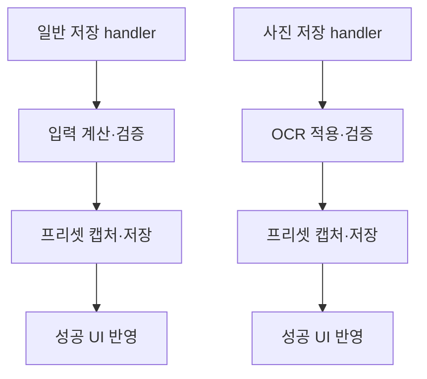
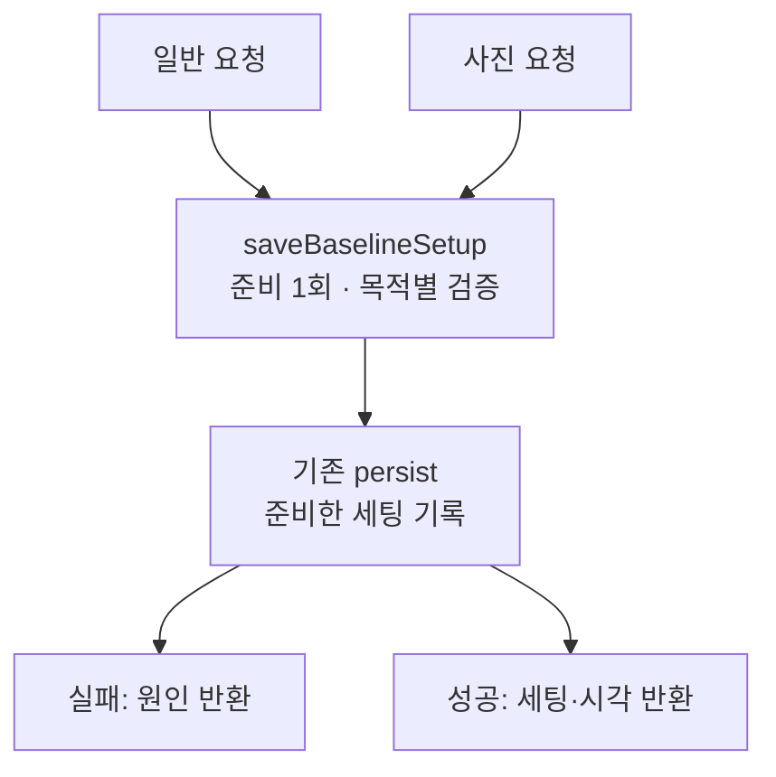
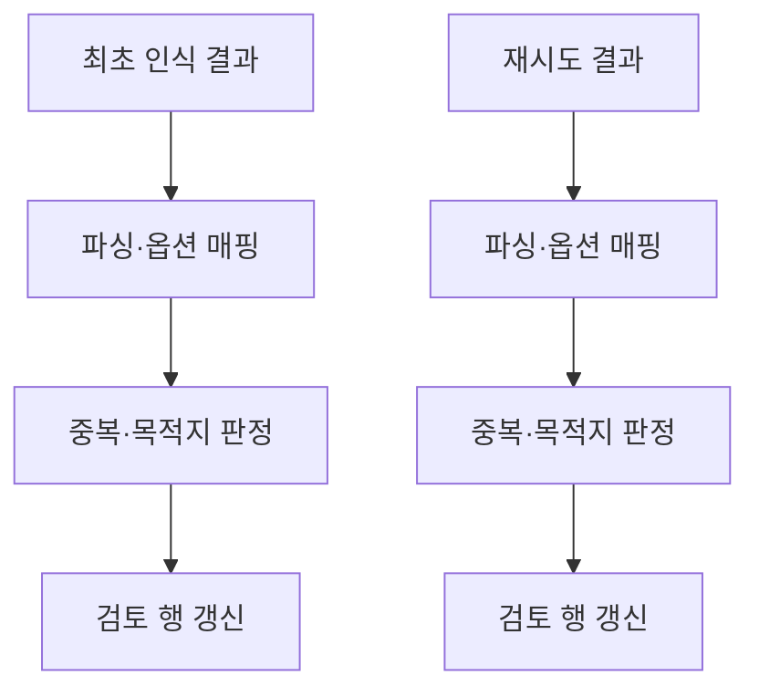
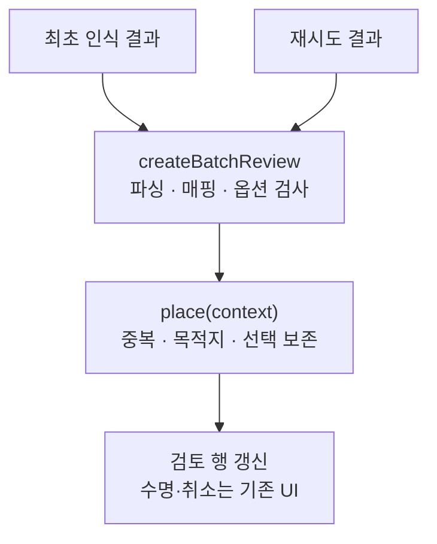
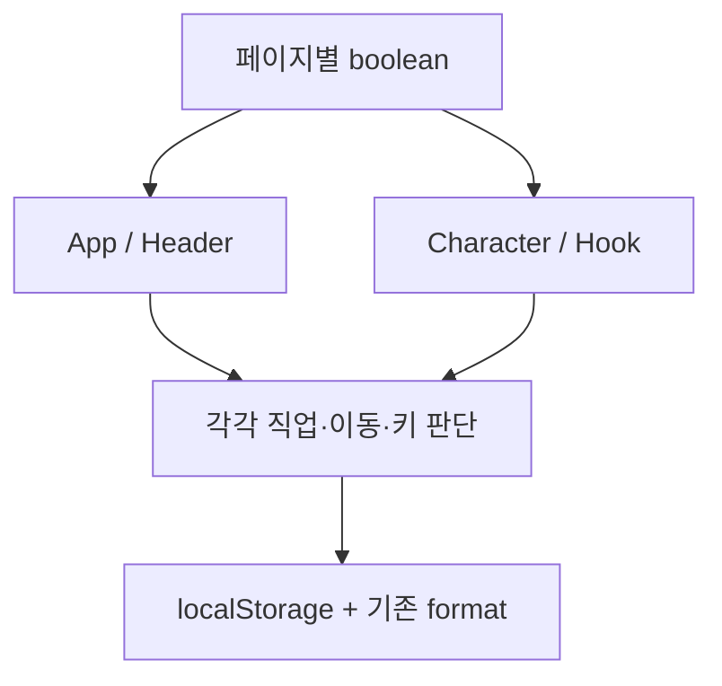
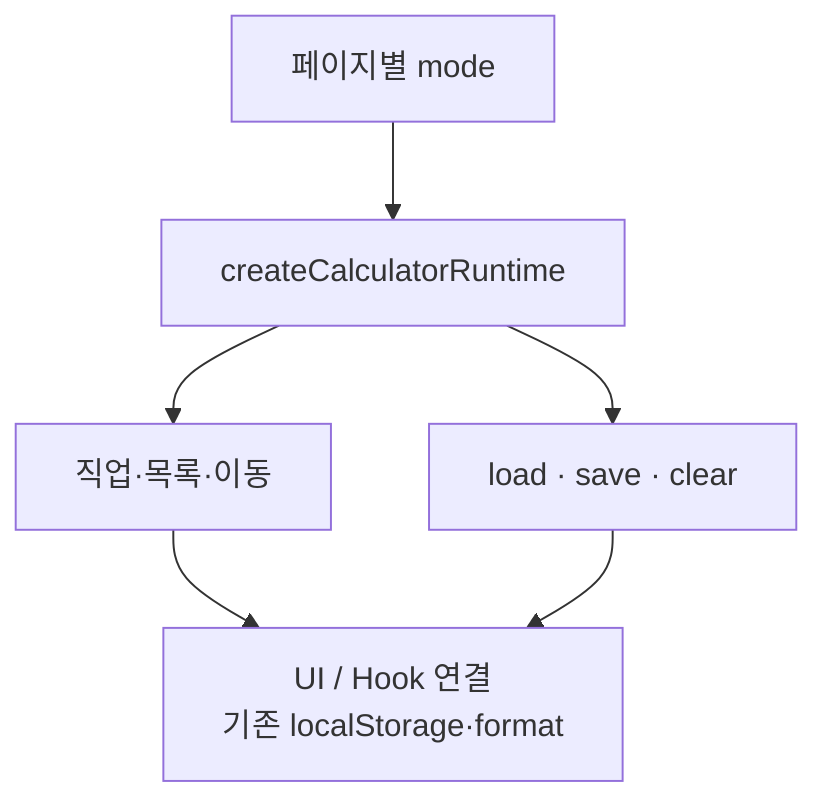
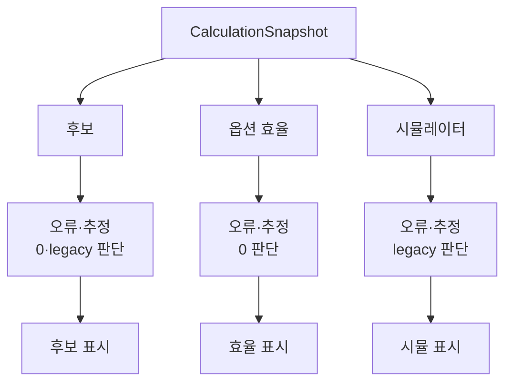
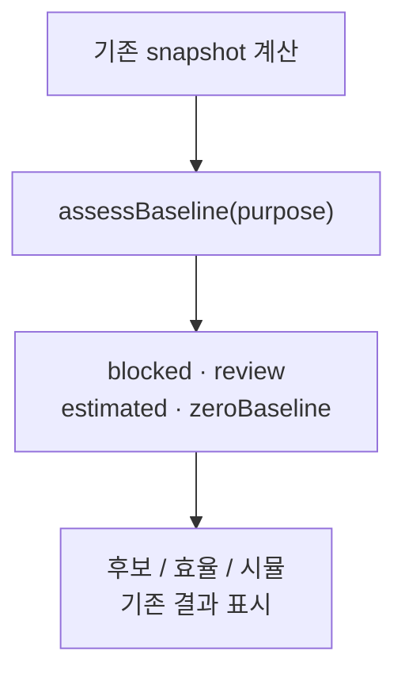

# 플래닛 계산기 구조 개선 PAAR 보고서

목차: [전체 PAAR — 네 흐름의 변경 지식을 모으다](#summary) · [읽는 기준 — module과 interface](#reading) · [1. 기준 세팅 저장 — saveBaselineSetup](#save) · [2. OCR 인식값 → 검토 행 — batchReview](#ocr) · [3. 직업별 실행·저장 맥락 — runtime](#runtime) · [4. 계산 가능 상태 — baselinePolicy](#policy) · [독립 리뷰와 작업 중 수정](#review) · [검증 — 명령, 실제 결과, 증거](#verification) · [보존 범위와 남은 한계](#limits) · [자료와 재현 방법](#evidence)

<a id="summary"></a>

## 전체 PAAR — 네 흐름의 변경 지식을 모으다

**현재 동작을 보존하는 구조 개선 A를 네 후보에 적용했다.** 저장 순서, OCR 검토 행 생성, 직업별 실행·저장 맥락, 계산 가능 상태의 판단을 각각 작은 module로 모았다. 성공 조건이나 게임 계산식을 일괄 통일하는 변경이 아니다.


관련 회귀 53개와 타입·lint·두 로컬 빌드는 통과했다. 전체 suite는 603개 통과·10개 실패로 미통과이며, 기준 커밋에서도 같은 10개 실패 테스트를 재현했다. 앱 브라우저 확인과 실제 Paddle 합성 OCR은 로컬 검증이다.


| 구분 | 내용 |
| --- | --- |
| 보고서 상태 | 네 구조 개선·관련 회귀 검증 완료 / 전체 suite 기존 10실패 / 게임 실측·운영 배포 미실행 |
| 작업 브랜치 | refactor/architecture-deepening |
| 기준 커밋 | 4a084bb1e9d2582f58548c9c72dad3a8a32e5f7b |
| 앱 소스 커밋 | 9b05190b4a3eece2d3b215822eb4b8c9e5d598ae |
| 보고서 생성 시각 | 2026-10-01 06:36:55 KST (UTC+09:00) |
| 작업 위치 | C:/Users/PC/.codex/worktrees/architecture-refactor/플래닛 |
| 대조 문서 | [TROUBLESHOOTING.md](../TROUBLESHOOTING.md) · [DECISIONS.md](../DECISIONS.md) · [AGENTS.md](../AGENTS.md) |
| 산출물 | [Markdown 보고서](architecture-paar-report.md) · [HTML 보고서](architecture-paar-report.html) |


### P · Problem — 확인한 문제


일반 저장과 사진 저장, OCR 최초 인식과 재시도, 페이지·hook·직업 선택, 후보·효율·시뮬레이터가 각각 관련 규칙을 알아야 했다. 변경할 때 한 곳의 코드만 읽어서는 다른 경로의 동작을 판단하기 어려웠다. 정적 검토에서 확인한 문제는 **중복과 변경 지식의 분산**이며, 원래 앱에서 데이터 유실이나 잘못된 직업 flag 조합의 운영 장애를 재현한 것은 아니다.


### A · Analysis — 분석


같은 계산과 저장 기능을 재사용하고 있어 전체 재작성보다 실제 호출 접점에 module을 두는 편이 적합했다. 같은 판단을 반복하더라도 목적별 정책은 같지 않았다. 사용자는 일반 저장의 허용·차단과 오류 순서를 보존하는 A를 선택했다. 이 선택은 네 구조 개선 전체를 진행하는 범위와 함께 D-ARCHITECTURE-IMPLEMENT-001에 기록했다.


### A · Action — 조치


| 사례 | 새 module | 호출자가 맡는 일 | 안쪽에 모은 지식 |
| --- | --- | --- | --- |
| TS-ARCH-001 | [saveBaselineSetup.ts](../features/calculator/saveBaselineSetup.ts) | 결과에 맞춘 화면·포커스·안내 | 한 번 준비 → 목적별 검증 → 같은 세팅 저장 → 결과 반환 |
| TS-ARCH-002 | [ocr/batchReview.ts](../features/calculator/ocr/batchReview.ts) | 비동기 인식 수명·행 상태·선택 순서 | 옵션 매핑·중복·장착 목적지·재시도 선택 보존 |
| TS-ARCH-003 | [runtime.ts](../features/calculator/runtime.ts) | 페이지에서 mode 선택·브라우저 연결 | 시작 직업·선택 목록·이동·키·복원·초기화 |
| TS-ARCH-004 | [domain/baselinePolicy.ts](../features/calculator/domain/baselinePolicy.ts) | 기존 snapshot 계산·목적별 결과 표시 | 순수 스탯 입력 여부·차단/검토/기준값0 정책 |


### R · Result — 결과의 의미


구조적 결과는 정책을 변경할 위치와 직접 검증할 interface가 모였다는 점이다. 저장 화면은 더 이상 준비·검증·저장 순서를 조립하지 않는다. 최초 OCR과 재시도는 같은 검토 규칙을 사용하고, 직업별 정책과 계산 목적별 차이를 한 파일에서 대조할 수 있다. **실행 시간 개선, 사용자 오류 감소율, OCR 정확도 향상은 측정하지 않았으므로 수치로 주장하지 않는다.** 최종 실행 근거는 뒤의 검증 표에 별도로 기록한다.


<a id="reading"></a>

## 읽는 기준 — module과 interface

PAAR는 **Problem(문제) → Analysis(분석) → Action(조치) → Result(결과)** 순서다. 각 사례에서 먼저 현재 코드의 마찰을 설명하고, 선택한 구조와 보존한 동작, 실제 확인 범위를 연결한다.


| 용어 | 이 보고서의 의미 |
| --- | --- |
| module | 하나의 interface와 그 뒤 implementation을 가진 코드 묶음. 여기서는 함수 중심으로 작게 만들었다. |
| interface | 타입뿐 아니라 호출 순서, 전제, 실패 결과, 입력 보존 조건을 포함해 호출자가 알아야 하는 사용 규칙. |
| seam | module의 interface가 놓인 호출 접점. 화면 상태와 도메인 판단이 만나는 위치 등. |
| depth | 작은 interface로 많은 동작을 다루는 정도. 코드 줄 수의 비율로 평가하지 않는다. |
| locality / leverage | 관련 변경 지식이 한 곳에 모이는 것 / 여러 호출자가 한 구현과 검증의 효과를 공유하는 것. |
| deletion test | 새 module을 지우면 복잡한 판단이 여러 호출자로 되돌아가는지 보는 설계 질문. |


보고서는 위 구조 판단과 실제 테스트 결과를 구분한다. 테스트가 통과해도 실제 게임 계산 전체, 사용자 사진의 무수정 완전 인식률, 운영 환경의 성능이 입증되는 것은 아니다.


<a id="save"></a>

## 1. 기준 세팅 저장 — saveBaselineSetup

### P · Problem


CalculatorApp의 일반 저장과 사진 등록 후 저장은 각각 계산 오류를 선별하고 활성 프리셋을 캡처한 뒤 저장소에 쓰고 성공 상태를 갱신했다. 두 경로의 검증 범위와 오류 순서는 달랐다. 화면 handler를 바꿀 때 저장 실패 전후의 입력·검토값·시각·dirty 상태를 함께 추적해야 했다.


### A · Analysis


저장 정책을 일괄 통일하면 A의 동작 보존 조건을 어긴다. 검증만 추출하면 화면에 저장 순서가 남는다. 반대로 화면 전체를 새 hook으로 옮기면 모달·후보·이탈 보호까지 한 module의 책임이 된다. **한 저장 시도 내부의 준비·검증·저장을 모으고, 화면 반영은 성공 결과를 받은 뒤 실행하는 함수**를 선택했다.


| 검토한 대안 | 판단 |
| --- | --- |
| 검증 helper만 추출 | 중복 조건 일부는 줄지만 준비 → 저장 → 성공 반영의 순서가 두 handler에 남는다. |
| 모든 저장 오류를 동일하게 차단 | 현행 일반 저장/사진 저장의 정책과 오류 우선순위를 바꾼다. 이번 A 범위에서 제외했다. |
| 한 요청 안에서 준비·검증·저장 후 결과 반환 | 새 칸 ID와 검증 대상·저장 대상·성공 결과를 같은 세팅으로 연결한다. 선택한 구조다. |


#### 변경 전



두 handler가 목적별 규칙과 저장 순서를 각각 조립했다.

#### 변경 후



공통 module이 저장 결과를 반환한다. React 상태 갱신과 안내는 화면에 남는다.


### A · Action


[saveBaselineSetup.ts](../features/calculator/saveBaselineSetup.ts)의 saveBaselineSetup을 [CalculatorApp.tsx](../features/calculator/CalculatorApp.tsx)의 일반·사진 저장 두 handler가 호출한다. 기존 [storage.ts](../features/calculator/storage.ts)의 직렬화·복원과 useSavedSetup의 브라우저 쓰기를 재사용한다.


```typescript
type SaveRequest =
  | { kind: "preset" }
  | { kind: "ocr"; job: JobId; entries: OcrBatchEntry[]; loading: boolean };

type BaselineSaveResult =
  | { ok: false; message: string; focusPath?: string }
  | { ok: true; input: CalculatorInput; savedAt: string; snapshot: string };

saveBaselineSetup(input, request, persist)
```


interface의 실패 결과에는 savedAt·snapshot·새 화면 상태가 없다. persist가 성공한 뒤에만 성공 결과가 나온다. 화면은 실패 시 기존 포커스와 메시지만 반영하며, 사진 목록은 기존 SetupImportPanel의 성공 응답 이후에만 정리된다. 일반 저장 성공은 원래대로 현재 input을 setInput으로 덮어쓰지 않는다.


| 보존 조건 | 실제 예시 |
| --- | --- |
| 준비는 한 시도에 1회 | OCR의 destination=new로 추가한 장비 칸 ID를 다시 만들지 않는다. persist의 입력과 성공 결과 input은 같은 준비 결과다. |
| 원문 보존 | 공격력 문자열 00100, 주스탯 빈칸, 부스탯 0, 순수 스탯과 비활성 프리셋을 숫자로 치환하지 않는다. |
| 활성 프리셋 권위 | 현재 편집 중인 무기·방어율을 captureWeaponPreset으로 반영한다. 오래된 프리셋 entries로 최신 편집을 덮어쓰지 않는다. |
| 실패 보존 | localStorage 쓰기 예외 시 기존 저장·savedAt·입력과 사진 검토를 유지한다. 프리셋 성공 모달은 열리지 않는다. |
| 범위 제한 | 초기화·불러오기·자동 저장·임시 구매 후보 저장·backend 교체는 재설계하지 않았다. |


| 현행 정책 | 일반 저장 | 사진 등록 후 저장 |
| --- | --- | --- |
| 잘못된 레벨 | 이 사유만으로 저장을 일괄 차단하지 않는 현행 동작 보존 | character.* 검사로 차단 |
| 신궁 화살 오류 | 다른 검사보다 먼저 차단 | 일괄 적용 성공 후 다른 캐릭터 검사보다 먼저 차단 |
| 오류 우선순위 | 화살 → 아란 참고 조건 → 크확 → 캐시 → 순수 스탯 | 복원 중/일괄 적용 → 화살 → 먼저 발견한 캐릭터·캐시 오류 |
| 착용 불가 warning | 이 경고만으로 일반 저장을 차단하지 않음 | 전체 계산 warning을 일괄 저장 차단으로 확대하지 않음 |


### R · Result


저장 interface에서 새 장비 ID의 1회 생성, 원문·프리셋 보존, 목적별 검증 차이·우선순위, 저장 실패를 확인하도록 회귀를 추가했다. UI 회귀는 실패 뒤 입력·dirty·사진 목록·성공 모달과 재시도를 관찰한다. 저장 실패의 savedAt 검증은 독립 리뷰 후 실제 저장 실패와 실제 화면/자식 interface 관찰로 보강했다. 검증 상태와 명령은 공통 결과 표에 기록한다.


Deletion test: 이 module을 없애면 목적별 검증 목록과 저장 순서가 다시 두 handler로 퍼진다. 화면에서 순서를 조립하는 단순 전달 함수로 끝나지 않았다.


<a id="ocr"></a>

## 2. OCR 인식값 → 검토 행 — batchReview

### P · Problem


EquipmentOcrBatchPanel의 최초 인식과 개별 재시도는 파싱, 옵션 매핑, 옵션 없음 판정, 이미지·이름/옵션 중복, 반지 예외, 목적지와 무기 프리셋을 각각 조립했다. 같은 규칙을 고칠 때 두 전이를 읽어야 했다.


### A · Analysis


OCR recognizer와 worker pool은 이미 판독·동시성·취소의 접점을 갖고 있으므로 유지했다. 공통 파싱 helper만 빼면 중복·목적지 지식은 화면에 남는다. 최초 선택 순서와 재시도의 이전 목적지·펜던트 선택은 서로 다른 맥락이어서 하나의 무조건 재배정 규칙으로 합칠 수 없다.


| 검토한 대안 | 판단 |
| --- | --- |
| parse/map helper만 공통화 | 중복과 장착 목적지의 지식 분산을 해결하지 못한다. |
| OCR worker·검토 UI 전체 재작성 | 취소·소유권·늦은 결과 방어까지 바꾸는 큰 범위가 된다. |
| 생성 후 live 맥락으로 place | 파싱·매핑을 먼저 하고, 비동기 이미지 hash 뒤 최신 행의 목적지/중복 맥락을 넣는다. 선택한 구조다. |


#### 변경 전



최초와 재시도가 검토 규칙을 각자 조립했다.

#### 변경 후



두 경로가 같은 interface를 사용하고, 최초/재시도 차이는 context로 남는다.


### A · Action


[ocr/batchReview.ts](../features/calculator/ocr/batchReview.ts)의 createBatchReview(text, review, job)가 옵션을 준비하고 place(context)가 검토 행 정보를 반환한다. [EquipmentOcrBatchPanel.tsx](../features/calculator/components/EquipmentOcrBatchPanel.tsx)는 원래 선택 순서의 flush와 재시도 attempt·파일 소유권·취소·워커 종료를 계속 담당한다.


```typescript
const recognition = createBatchReview(text, review, job);
// 적용할 옵션도 미해결 검토 질문도 없으면 null
const row = recognition?.place({
  kind: "initial", choices, reserved, peers, sameImage,
});

// 재시도는 같은 interface에 이전 선택과 현재 맥락을 제공한다.
recognition?.place({
  kind: "retry", choices, reserved, peers, sameImage,
  previous, replacedFile, initialBusy,
});
```


| interface 입력 | 의미 |
| --- | --- |
| text / review / job | OCR 원문·검토값·직업별 매핑. review가 있으면 그 category와 검토값을 사용한다. |
| choices / reserved / peers | 현재 장착 칸, 이미 배정한 목적지, 비교할 기존 인식 행. |
| sameImage | 동일 이미지가 있을 때 파일명. 빈 파일명도 중복 존재를 의미한다. |
| retry의 previous / replacedFile / initialBusy | 같은 파일·같은 분류의 이전 선택을 유지할지, 새 목적지 확인이 필요한지 판정하는 맥락. |


| 보존한 동작 | 예시 |
| --- | --- |
| 선택 순서 | 병렬 판독 완료 순서로 반지 1~4와 중복 우선권을 정하지 않는다. |
| 반지 예외 | 다른 이미지의 같은 옵션 반지는 별개 장비로 유지한다. 완전히 같은 이미지는 반지에도 중복 경고가 우선한다. |
| 무기 목적지 | 건·석궁·아대·무기는 방무가 있으면 chaos, 그 외 보공이 있으면 boss, 그 외 hunting을 선택한다. |
| 재시도 선택 | 파일 교체가 없고 분류가 같으면 이전 목적지·label·pendantChoice·needsDestination을 보존한다. |
| 늦은 결과 | 기존 attempt·파일·AbortController 검사가 남는다. 이 module이 취소 수명을 대신 관리하지 않는다. |


### R · Result


검토 module에서 옵션 없음, 중복, 같은 옵션 반지, 무기 프리셋, 재시도 보존과 기존 폴암 목적지를 직접 관찰하는 회귀를 추가했다. 독립 리뷰는 새 공통 코드가 sameImage의 파일명 truthiness로 중복 존재를 검사한 **리팩터링 중 회귀**를 발견했다. sameImage !== undefined로 고쳤고 빈 파일명 동일 이미지의 최초·재시도 module/UI 회귀로 보강했다. 이를 원래 앱에 이미 있던 버그로 설명하지 않는다.


**기존 한계:** 목적지의 무기 분류 목록에 폴암이 없어서 아란 폴암은 new로 분류된다. 이번 A 범위에서는 기존 동작을 보존했고 회귀에 명시했다. 폴암을 무기 프리셋으로 배정하는 정책 변경은 별도 후속이다. 이번 구조 변경은 실제 사진의 OCR 인식 정확도 개선이나 사용자 보정 0회 목표 달성을 입증하지 않는다.


Deletion test: module을 제거하면 옵션 없음·중복·반지 예외·목적지 판정이 최초와 재시도에 다시 퍼진다.


<a id="runtime"></a>

## 3. 직업별 실행·저장 맥락 — runtime

### P · Problem


페이지의 captainBeta·aranBeta·marksmanBeta·development boolean, useSavedSetup의 위치 인자, AppHeader·CharacterPanel의 직업 선택과 brand 조건에 관련 정책이 나뉘었다. 기존 실제 페이지의 호출 조합은 명확했으며 잘못된 flag 조합의 런타임 장애를 확인한 것은 아니다.


### A · Analysis


상수만 옮기면 호출자가 flag 우선순위와 복원·초기화 의미를 계속 판단한다. 범용 repository adapter나 저장 backend 교체는 필요하지 않았다. **페이지가 하나의 mode를 고르면 시작 직업·선택·이동·저장 동작을 함께 정하는 runtime**을 선택했다. 계산의 JOB_RULES와 저장 format은 기존 위치에 둔다.


| 검토한 대안 | 판단 |
| --- | --- |
| boolean 유지 + 저장 키 상수 이동 | caller의 조합·복원·초기화 지식이 남는다. |
| 범용 저장 repository 체계 | 현재 브라우저 저장 하나에 비해 불필요한 추상화를 늘린다. |
| mode에서 실행 맥락 생성 | 페이지가 선택하는 의미와 관련 정책이 함께 움직인다. 선택한 구조다. |


#### 변경 전



여러 caller가 mode flag의 조합과 우선순위를 알았다.

#### 변경 후



페이지는 mode 하나를 고른다. runtime이 실행·저장 정책을 제공한다.


### A · Action


[runtime.ts](../features/calculator/runtime.ts)의 createCalculatorRuntime을 CalculatorApp에서 만들고, [useSavedSetup.ts](../features/calculator/hooks/useSavedSetup.ts)는 runtime에 window.localStorage를 연결한다. 페이지는 mode를 지정한다. AppHeader·CharacterPanel은 runtime의 brand·jobs를 사용한다.


```typescript
type CalculatorMode =
  | "captain" | "aran" | "marksman" | "development" | "sandbox";

const runtime = createCalculatorRuntime(mode, developmentDefault);
// 초기 화면·선택 정책
runtime.initialJob; runtime.jobs; runtime.brand;
runtime.publicSelection; runtime.development;
runtime.destination(job);
// 브라우저 저장은 hook에서 supplied storage로 연결
runtime.load(storage);
runtime.save(storage, input);
runtime.clear(storage);
```


| mode | 시작 직업 | 저장 키 | 선택·이동 |
| --- | --- | --- | --- |
| captain | corsair | planet-lab:damage-setup:corsair-beta:v1 | 캡틴·아란·신궁 → 각 공개 경로 |
| aran | aran | planet-lab:damage-setup:aran-beta:v1 | 캡틴·아란·신궁 → 각 공개 경로 |
| marksman | marksman | planet-lab:damage-setup:marksman-beta:v1 | 캡틴·아란·신궁 → 각 공개 경로 |
| development | corsair | planet-lab:damage-setup:development:v1 | 나이트로드 포함, 현재 화면에서 기존 직업 변경 |
| sandbox | corsair | planet-lab:damage-setup:v1 | 나이트로드 포함, 기존 일반 실행 동작 |


| 복원·초기화 계약 | 보존 내용 |
| --- | --- |
| 키 격리 | 아란·신궁은 전용 키를 사용하고 다른 직업의 저장값을 가져오거나 덮어쓰지 않는다. |
| 캡틴 fallback | 전용 키가 없으면 구형 공용 키를 읽을 수 있다. 직업이 corsair가 아니면 기존 unsupported-job 결과로 거절한다. |
| 신궁 seed 격리 | 신궁은 구형 공용 키와 developmentDefault를 읽지 않는다. |
| 명시적 초기화 | 저장 문자열 null은 empty로 해석하며 구형 저장이나 seed가 부활하지 않게 한다. |
| 기존 clear 차이 | 캡틴·신궁 또는 seed가 있는 맥락은 null sentinel을 쓴다. seed 없는 아란 등은 removeItem 의미를 유지한다. |
| 공개 선택 | 캡틴 / · 아란 /aran · 신궁 /marksman 이동을 유지한다. 공개 선택에는 나이트로드를 추가하지 않는다. |


### R · Result


페이지와 hook이 여러 boolean의 저장 키 우선순위를 재구현하지 않는다. runtime의 같은 interface로 직업·이동·키 격리·잘못된 직업 복원 거절·신궁 seed 격리·초기화 후 부활 방지를 회귀 검증한다. 기존 캡틴 구형 저장과 개발 기본값 UI 회귀도 연결했다. 공개 경로의 신규 배포나 사용자 저장 schema 변경을 수행한 것은 아니다.


Deletion test: runtime을 없애면 페이지 맥락·직업 목록·이동·복원·초기화 규칙이 App, hook, Header, CharacterPanel로 다시 나뉜다.


<a id="policy"></a>

## 4. 계산 가능 상태 — baselinePolicy

### P · Problem


후보 비교, 옵션 효율, 추가 스탯 시뮬레이터는 같은 CalculationResult의 입력 오류·무기 누락·착용 불가·추정 여부·구형 데미지 상태를 각각 분류했다. 하지만 목적별 허용 차이가 있었으므로 하나의 canCalculate boolean으로 합칠 수 없었다.


### A · Analysis


공통 사실만 추출하면 각 caller에 정책 분기가 남고, 모든 목적을 하나의 차단 정책으로 합치면 동작이 바뀐다. **공통 기준 상태와 목적별 우선순위를 함께 가진 assessBaseline(purpose, results, estimated)**를 선택했다. 계산 수식과 snapshot은 기존 module에 두고 이 module은 결과의 해석만 담당한다.


| 검토한 대안 | 판단 |
| --- | --- |
| 오류 code 확인 helper만 추가 | 작은 중복은 줄지만 목적별 판단 지식이 여러 caller에 남는다. |
| 공통 canCalculate boolean | 추정 허용·구형 데미지·기준값0의 기존 차이를 표현하지 못한다. |
| 목적별 assessBaseline 결과 | blocked·review·estimated·zeroBaseline으로 현행 차이를 드러낸다. 선택한 구조다. |


#### 변경 전



수식은 공유했지만 계산 가능 상태의 의미는 각각 판단했다.

#### 변경 후



수식을 유지하고 상태 해석을 목적별 정책이 있는 module로 모았다.


### A · Action


[domain/baselinePolicy.ts](../features/calculator/domain/baselinePolicy.ts)를 [candidates.ts](../features/calculator/domain/candidates.ts)·[optionEfficiency.ts](../features/calculator/domain/optionEfficiency.ts)·[statSimulation.ts](../features/calculator/domain/statSimulation.ts)에서 사용한다. hasMeasuredPureStats는 문자열 trim 뒤 입력 존재만 확인한다. 숫자 유효성은 기존 계산 검증이 맡으며 0을 빈칸으로 취급하지 않는다.


```typescript
hasMeasuredPureStats(input): boolean
assessBaseline(
  purpose: "candidate" | "efficiency" | "simulation",
  results: readonly CalculationResult[],
  estimated: boolean,
)
// 반환: { estimated, blocked: string[], review: string[], zeroBaseline: boolean }
```


| 상태 | 구매 후보 | 옵션 효율 | 시뮬레이터 |
| --- | --- | --- | --- |
| 실제 순수 스탯 미입력 | 확정 비교 차단 | 추정 표시로 계산 가능 | 추정 표시로 계산 가능 |
| 입력 오류·무기 누락·착용 불가 | 차단, 전후 결과의 메시지 순서 보존·중복 제거 | 입력 오류 → 무기 누락 → 착용 불가 순서로 보류 | 입력 오류 → 무기 누락 → 착용 불가 순서로 보류 |
| 구형 보공/총데미지 미분리 | 검토 사유 | 이 사유만으로 별도 차단하지 않음 | 보류 |
| 기준 환산공0 | 교체 전 스탯공/환산공0이면 비율 검토 사유 | 0·비유한 환산공은 상승률 보류 | 결과 계산 가능, 기준값0 비율은 기존 null |


후보의 요구치 미인식·펜던트 종류·지원 직업·교체 부위 검사는 기존 candidates에 남는다. 시뮬레이터 변경량 범위와 음수 옵션 검사는 기존 statSimulation에 남는다. 저장 허용 정책과 계산 가능 정책을 같은 제한으로 확장하지 않았다.


### R · Result


세 흐름에서 같은 오류 code·착용 상태를 별도로 해석하던 부분을 모았고, 목적별 차이는 표와 interface 회귀로 관찰한다. 순수 스탯 0/빈칸, legacy 검토/허용/차단, 오류 우선순위, 후보의 교체 전 기준값0와 교체 후0 구분, 효율의 비유한 값, 시뮬레이터0 허용을 확인하도록 회귀를 추가했다. 이는 기존 계산 모델의 내부 동작 보존 확인이며 게임 실측 정확성의 신규 인증이 아니다.


Deletion test: module을 없애면 입력 존재와 오류·무기·착용·legacy·0의 해석이 세 caller에 다시 분산된다.


<a id="review"></a>

## 독립 리뷰와 작업 중 수정

| 발견 | 분류·수정 | 검증 보강 |
| --- | --- | --- |
| 새 batchReview의 sameImage truthiness | 리팩터링 중 회귀. 빈 문자열도 동일 이미지 존재이므로 !== undefined로 수정했다. | 빈 파일명 동일 이미지의 최초·재시도 module 및 UI 회귀. |
| 저장 실패 savedAt 검증이 자기 상수 비교 | 검증 공백. 기존 앱의 버그로 단정하지 않았다. | 실제 localStorage 쓰기 실패와 저장된 savedAt, OCR 화면 time 및 일반 저장의 자식 interface 상태를 관찰. |
| 일반 저장 오류일 때 time 표시 | 기존 UI는 저장 오류가 있으면 시각을 숨긴다. 이를 유지한다. | 오류 뒤 시각 표시가 없어지는 현행 동작과 내부 savedAt 보존을 구분해 확인. |
| 초기 import/fixture 실패 | 구현·검증 준비 중 수정한 문제. 최종 결과와 분리한다. | 수정 뒤 실행 결과를 최종 검증 표에서 확인한다. |


독립 리뷰의 목적은 interface의 동작 보존과 테스트가 실제 결과를 관찰하는지 확인하는 것이었다. 통과 숫자만으로 완전한 검증을 주장하지 않는다. 앱에서 이미 존재하던 폴암 목적지 제한과 이번 리팩터링 중 회귀는 별개다.


<a id="verification"></a>

## 검증 — 명령, 실제 결과, 증거

**이번 관련 회귀는 7개 파일 53개 모두 통과했다. 전체 suite는 63개 파일·613개 테스트 중 603개 통과, 10개 실패로 미통과다.** 기준 커밋의 clean git archive에서 같은 6개 파일을 실행해 동일한 10개 실패 테스트를 재현했다. 실패 테스트 집합에 신규 항목은 없지만, 이를 전체 suite 합격이나 모든 조건 무회귀 증명으로 확대하지 않는다.


| 검증 | 최종 결과 | 근거 |
| --- | --- | --- |
| 관련 회귀 | 7파일 / 53통과 / 0실패 / exit0 | [final-targeted.json](../output/architecture/final-targeted.json) · [log](../output/architecture/final-targeted.log) |
| 전체 suite | 63파일(57통과·6실패) / 613개(603통과·10실패) / success:false / exit1 | [full-suite-final.json](../output/architecture/full-suite-final.json) · [log](../output/architecture/full-suite-final.log) |
| clean 기준의 실패군 재현 | 6파일 / 73개(63통과·10실패) / exit1. 기준 테스트·핵심 소스 blob 대조 | [baseline-regression.json](../output/architecture/baseline-regression.json) · [실패 집합 비교](../output/architecture/baseline-comparison.json) |
| 기준 캡틴 UI 단독 추가 확인 | 1파일 / 2개(1통과·1실패) / exit1. 공개 직업 선택 disabled 기대 불일치 재현 | [baseline-captain-alone.json](../output/architecture/baseline-captain-alone.json) · [log](../output/architecture/baseline-captain-alone.log) |
| lint | 오류 0 / 경고 0 | [lint.log](../output/architecture/lint.log) |
| 앱·worker 타입 검사 | 통과(exit0), 마지막 Next 빌드 뒤 순차 실행 | [typecheck.log](../output/architecture/typecheck.log) |
| Vinext 빌드 | 통과(exit0). route 정적 분류 안내 메시지는 남음 | [build-vinext.log](../output/architecture/build-vinext.log) |
| Vercel 대상 Next 빌드 | 통과(exit0). 로컬 빌드이며 원격 배포 아님 | [build-vercel.log](../output/architecture/build-vercel.log) |
| 격리 앱 브라우저 | 저장·복원·직업·키 격리·범위/포커스 등 16항목 통과 | [app-browser-evidence.json](../output/playwright/app-browser-evidence.json) |
| 합성 이미지의 실제 OCR | 브라우저 Paddle로 DEX18/STR3/요구치0 인식·검토·망토 목적지 확인 | [ocr-evidence.txt](../output/playwright/ocr-evidence.txt) |
| OCR 저장 실패/재시도 UI | 8항목 통과. quota 실패 시 이전 저장·보이는 시각·입력·검토 보존, 재시도 성공 뒤 목록 정리 | [ocr-save-evidence.txt](../output/playwright/ocr-save-evidence.txt) |
| 이탈 보호 | 사진 검토 이탈 취소 뒤 URL·목록 유지, 수정 상태 이탈 수락 뒤 신궁 이동·캡틴 저장공112 유지 | [pending-after-dismiss.txt](../output/playwright/pending-after-dismiss.txt) · [이탈 수락 JSON](../output/playwright/app-browser-evidence.json) |
| 보고서 자체 검증 | 10섹션/8SVG. 본문 누락·깨진 링크·중복 id 0. 1440/768/390/320px 가로 넘침0, 파일+offline 렌더 확인 | [static-check.json](../output/architecture-report/static-check.json) · [browser-evidence.json](../output/architecture-report/browser-evidence.json) |


### 기존 실패 10개 — 계산/정책 변경으로 숨기지 않음


| 기존 실패 파일 | 개수 | 현재 기대와의 차이 |
| --- | --- | --- |
| [attack-buffs.test.ts](../tests/calculator/attack-buffs.test.ts) | 1 | 이전 신궁 기본 공격력 기대 |
| [calculator-app.test.tsx](../tests/calculator/calculator-app.test.tsx) | 1 | 공개 직업 선택을 캡틴1종으로 기대 |
| [captain-beta-ui.test.tsx](../tests/calculator/captain-beta-ui.test.tsx) | 1 | 공개 직업 선택창 disabled 기대 |
| [preset-stat-window.test.tsx](../tests/calculator/preset-stat-window.test.tsx) | 1 | 이전 신궁 크리 출처 기대 |
| [projectile-ui.test.tsx](../tests/calculator/projectile-ui.test.tsx) | 1 | 신궁 화살 기본20 기대, 현행0 |
| [reference-cases.test.ts](../tests/calculator/reference-cases.test.ts) | 5 | 이전 신궁 기준 스탯공·크리·샤프 기여 기대 |


기준과 최종 결과의 상대 파일명+fullName 실패 집합을 대조했다. 기준의 captain-beta-ui 첫 묶음 실행은 초기 복원 대기 timeout 단계에서 실패했지만, 해당 파일 단독 추가 실행에서 최종 suite와 같은 직업 선택창 disabled 기대 불일치를 확인했다. 따라서 같은 10개 테스트가 실패한다고 기록하며 **10개의 오류 메시지까지 모두 동일하다고 기록하지 않는다.** 기존 테스트의 expectations와 계산 수식을 이번 리팩터링에 맞춰 완화하거나 바꾸지 않았다.


### 실행 명령과 환경


전체 명령·소스/기준 SHA·최종 로그 목록은 [verification-summary.json](../output/architecture/verification-summary.json)에 연결했다.


앱 검증은 구현 담당자가 실행했고, 보고서 담당자는 해당 실제 JSON/log를 읽고 문서 자체만 확인했다. 다음 명령은 이번 검증 범위를 재현한다. clean 기준 실행은 output/architecture/baseline에서 기준 커밋 테스트·소스를 사용한다.


```powershell
npx vitest run tests/calculator/baseline-save.test.ts tests/calculator/batch-review.test.ts tests/calculator/baseline-policy.test.ts tests/calculator/runtime.test.ts tests/calculator/setup-import.test.tsx tests/calculator/ocr-batch-ui.test.tsx tests/calculator/ui-safety.test.tsx --maxWorkers=4 --reporter=default --reporter=json --outputFile.json=output/architecture/final-targeted.json
npx vitest run --maxWorkers=4 --reporter=default --reporter=json --outputFile.json=output/architecture/full-suite-final.json
npm run lint
npm run build:vercel
npm run typecheck
npm run build
```


```powershell
# clean 기준 아카이브 안에서 기존 실패 6파일 확인
npx vitest run tests/calculator/attack-buffs.test.ts tests/calculator/calculator-app.test.tsx tests/calculator/captain-beta-ui.test.tsx tests/calculator/preset-stat-window.test.tsx tests/calculator/projectile-ui.test.tsx tests/calculator/reference-cases.test.ts --maxWorkers=4 --reporter=default --reporter=json --outputFile.json=../baseline-regression.json
# 캡틴 파일은 단독으로 assertion 단계 추가 확인
npx vitest run tests/calculator/captain-beta-ui.test.tsx --maxWorkers=1 --reporter=default --reporter=json --outputFile.json=../baseline-captain-alone.json
```


앱 브라우저는 본인 전용 localhost:3107의 로컬 Next 빌드와 architecture-final session에서 합성 입력·저장 공간 예외를 사용했다. 일반 앱 확인은 console error/warning 0이었다. OCR의 stderr 27건은 모두 ONNX Runtime [W:] CleanUnusedInitializersAndNodeArgs의 unused initializer 제거 메시지였고 실제 합성 인식·저장은 성공했다. 이를 OCR 경고가 전혀 없거나 운영 OCR 품질 검증이 끝났다고 표현하지 않는다.


보고서 확인은 별도 architecture-report session과 전용 localhost:3251을 사용했다. 네트워크 offline 상태에서 file:// HTML을 직접 열어 본문과 SVG를 확인했다. HTML에는 외부 리소스와 실행 script가 없고 data URI favicon을 사용한다. 모바일 표는 항목명을 함께 표시하는 세로 행으로 바뀐다. 본인 보고서 서버와 session만 종료하며 기존3000 서버는 보존한다.


```powershell
python output/architecture-report/verify-report.py
npx --yes --package @playwright/cli playwright-cli --session=architecture-report run-code --filename output/architecture-report/browser-check.js
npx --yes --package @playwright/cli playwright-cli --session=architecture-report run-code --filename output/architecture-report/offline-check.js
```


| 대표 보고서 캡처 | 확인 목적 |
| --- | --- |
| [desktop-final.png](../output/architecture-report/desktop-final.png) | 결론·기준/source commit·PAAR 요약 |
| [desktop-diagrams-final.png](../output/architecture-report/desktop-diagrams-final.png) | 변경 전 병렬 중복 → 변경 후 공통 module |
| [mobile-save-final.png](../output/architecture-report/mobile-save-final.png) | 320px 본문·코드·항목별 표 가독성 |
| [offline-final.png](../output/architecture-report/offline-final.png) | network offline의 file 렌더 |


증거 파일은 Git 제외 output 경로에 둔다. 저장소에 커밋되는 두 보고서는 자체 본문·그림을 포함하지만, 다른 환경에는 이 로컬 검증 증거가 함께 제공되지 않을 수 있다. 이 경우 링크 대신 결과 표와 소스 커밋을 기준으로 범위를 읽는다.


<a id="limits"></a>

## 보존 범위와 남은 한계

- **게임 계산식 보존:** 최대 스탯공·환산공의 수식, floor 순서, 공% 대상, 고정 순수 스탯, 프리셋·호밍·직업별 현행 모델을 변경하지 않았다.
- **입력·저장 보존:** 빈칸/0/구형 원문, 저장 key·schema·직렬화, 후보 임시 상태, 실패 시 보존과 UI 안내 차이를 유지한다.
- **사진 처리:** recognizer·worker pool과 브라우저 내부 OCR 경계를 유지한다. 보고서에는 사용자 사진·OCR 원문·개인 세팅을 넣지 않는다. 이번 작업에서 사용자 사진의 외부 전송은 없다.
- **원본 작업:** 별도 승인된 worktree에서 작업한다. C:/Users/PC/Documents/플래닛의 병행 변경·기존 개발 서버3000을 수정하거나 종료하지 않는다.
- **배포 범위:** 비운영 refactor/architecture-deepening의 소스·문서 작업이다. dev-main/main 병합·푸시, 새 공개 경로 반영, Vercel Production 배포는 수행하지 않는다.
- **QA 한계:** 자동 회귀·격리 브라우저·합성 자료의 결과는 게임 실측·실제 사용자 POC·운영 부하 검증·OCR 무수정 완전 인식률과 구분한다.
- **후속:** 폴암 목적지 정책, 일반/사진 저장의 검증 통일, 미확정 직업 공식이나 새 저장 backend는 이번 동작 보존 리팩터링의 결과로 도입하지 않는다.


줄 수 감소를 품질·성능의 대리 지표로 사용하지 않았다. 기대 효과는 유지보수할 때 관련 판단을 찾고 고치는 위치가 명확해지는 것이며, 실제 개발 시간이나 운영 오류 감소는 별도 측정이 필요하다.


<a id="evidence"></a>

## 자료와 재현 방법

두 보고서는 같은 구조화 본문에서 생성한다. HTML은 내장 CSS·SVG만 사용하고 외부 CDN·웹폰트·필수 JavaScript가 없다. 저장소 밖으로 HTML 한 파일을 복사해도 본문과 그림은 읽을 수 있다. 소스·로그 링크는 저장소 안에 함께 있을 때 열 수 있는 보조 자료다.


| 자료 | 역할 |
| --- | --- |
| [TROUBLESHOOTING.md](../TROUBLESHOOTING.md) | TS-ARCH-001~004의 진단·설계·최종 기술 기록 |
| [DECISIONS.md](../DECISIONS.md) | 사용자 확정 A·별도 worktree·작업/배포 범위의 원장 |
| [CONTEXT.md](../CONTEXT.md) | 기준 세팅·순수 스탯·환산공 등 도메인 용어 |
| [baseline-save.test.ts](../tests/calculator/baseline-save.test.ts) | 저장 interface의 성공·실패·원문·ID·정책 순서 |
| [batch-review.test.ts](../tests/calculator/batch-review.test.ts) | 검토 interface의 중복·목적지·재시도 |
| [runtime.test.ts](../tests/calculator/runtime.test.ts) | 실행 맥락의 직업·이동·key·seed·clear |
| [baseline-policy.test.ts](../tests/calculator/baseline-policy.test.ts) | 목적별 허용·차단·검토·0 정책 |


재검증은 앱 루트인 이 worktree에서 수행한다. 구현 담당자의 앱 검증 명령과 보고서 자체 확인은 위 결과 표에 구분했다. 보고서 전용 HTTP 서버와 Playwright session만 사용하며 기존 서버나 사용자 브라우저 저장값을 재사용하지 않는다.
